<p align="left">
  <!--img width="120" alt="router hero banner" src="logo.png"-->
  <h2 align="left">Open Pandemic App</h2>
</p>

[](https://github.com/open-wc)

This App is based on this idea: [Corona Madrid](https://coronamadrid.comunidad.madrid/)

Open Pandemic App is a Progressive Web App (PWA) that helps to monitorize the health of those citizens that have been affected by the coronavirus lock down.

The main features this Apps include are:

* 📝 Evaluate the health of the user according to his symptoms 
* ⏰ Periodic reevaluations and keeping his health status up to date.
* 📲 Receive instructions and recommendations based on your health status
* 🏥 Help to health professionals that are working for our security and wellfare
* ❤️ Generate a personalized QR code based on your symptons, location and infected people in your vecinity (Contact tracing).

## Screenshots

| | | |  
|:--:|:--:| :--:|  
| 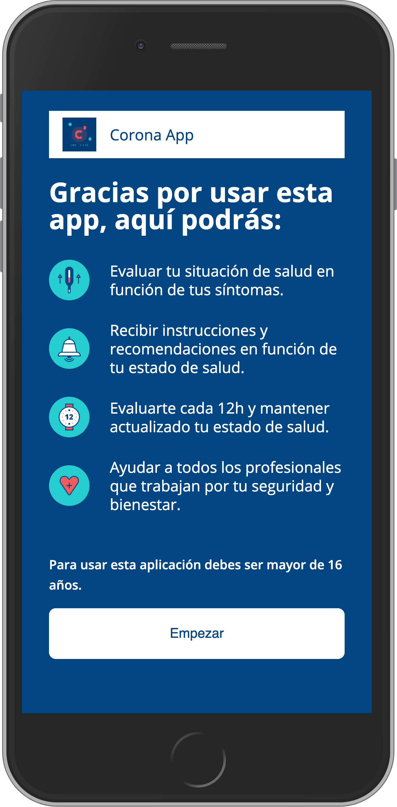 | 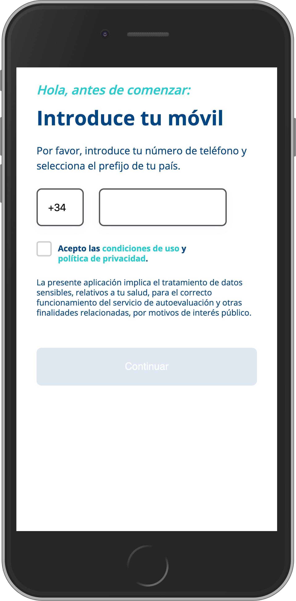| 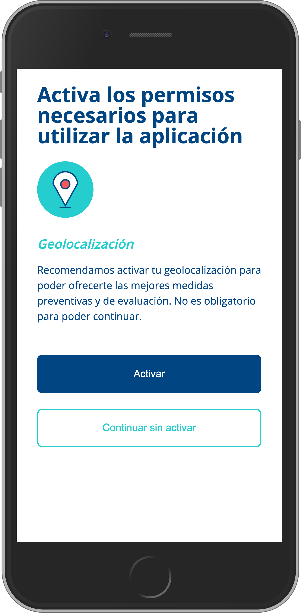
| 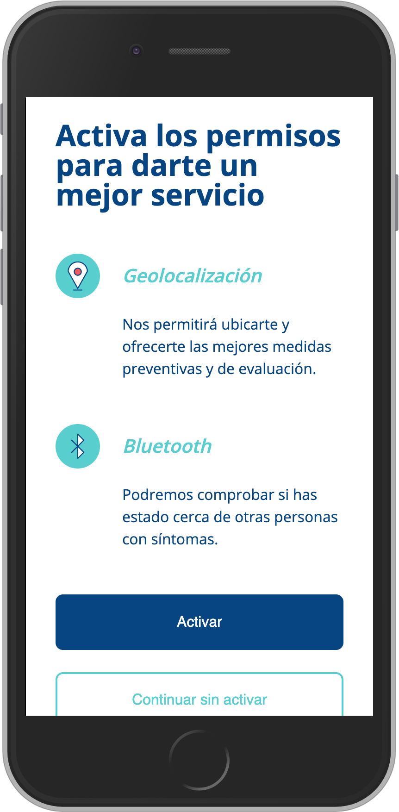 | 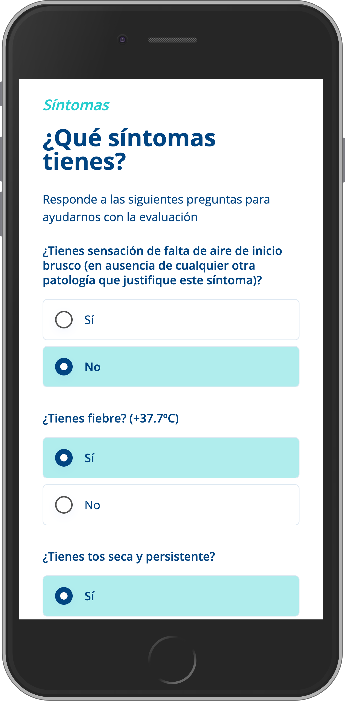| 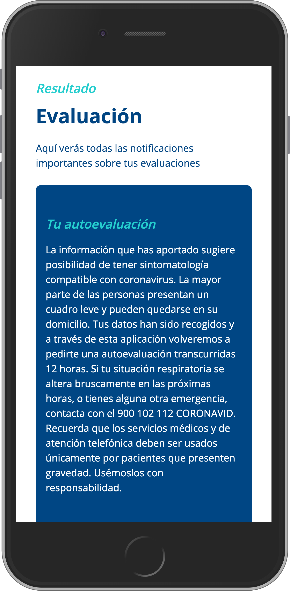
| 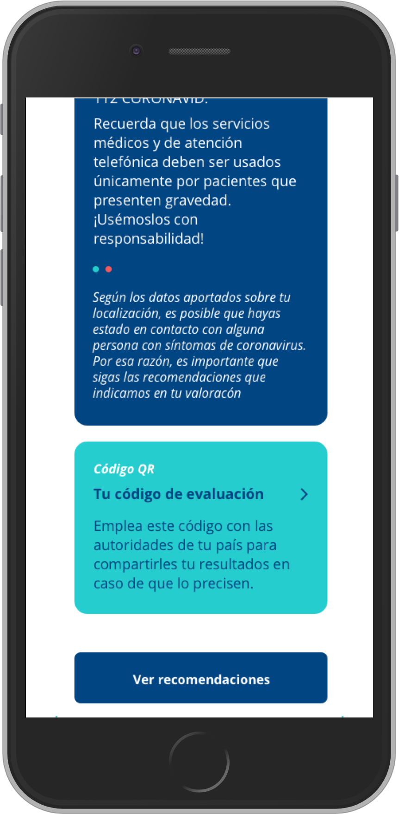 | 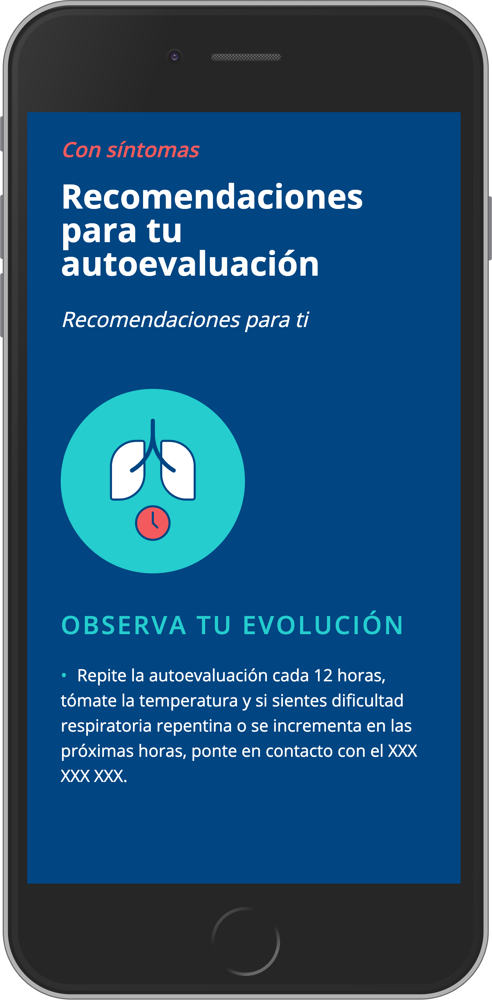| 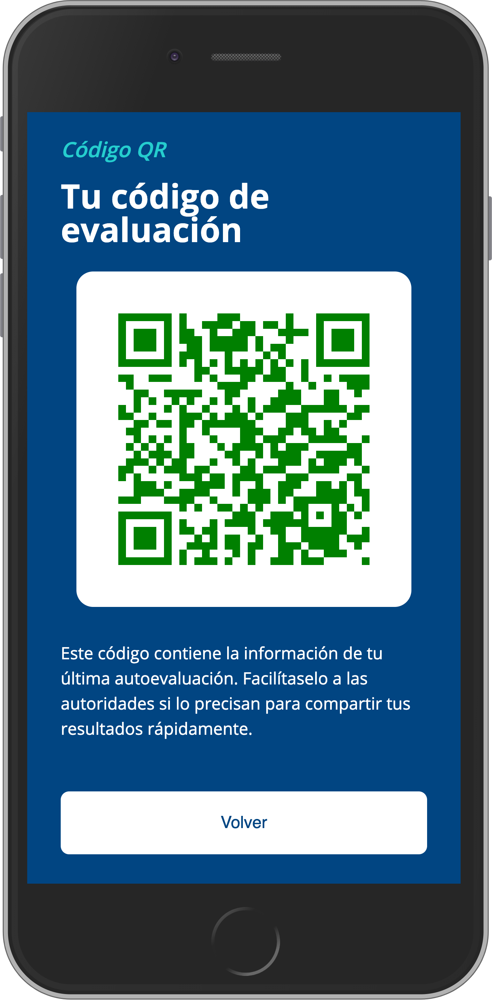

## Tech Stack

In the development of this App the next libraries have been used:

* [open-wc](https://open-wc.org/). Open Source project for web components recommendations and best practices
* [LitElement](https://lit-element.polymer-project.org/). The whole app has been developed following web component standards using LitElement as the base library.
* [Vaadin Router](https://vaadin.com/router). Small JS library (<7kb) for managing routes in the Application.
* [Firebase](https://firebase.google.com/). Firebase's web sdk has been used to connect to cloud and authentication services.
* [Google Recaptcha](https://www.google.com/recaptcha/intro/v3.html). Free google service to protect your site from spam attacks
* [Web Component Qr code](https://github.com/educastellano/qr-code). Web Component to generate QR codes

## Project structure

```
openpandemic-app
│  
├── openpandemic-web
├── openpandemic-mobile
│   ├── android
│   └── ios
└── openpandemic-functions
```

The project is structured in the following manner:
* `openpandemic-web`: Contains web source code. It's the PWA itself. This App can be used without the mobile application if you dont want to include contact tracing capabilities.
* `openpandemic-mobile`: Contains IOS and Android source codes to pack the web app into a native App.
* `openpandemic-functions`: Contains the source code running on Firebase Functions.


## Scripts

This project requires Node 10 and npm 6 or above.

Most of the utilities to test, build and serve the App can be found in 'package.json' file to reduce the number of files in the project.

You can run the scripts using npm from the project's root folder:

```bash
# Launches the application for development, reloading with every change.
npm run start

# Launches the application after executing the build command
npm run start:build

# Builds the app for production. App is generated in 'dist' folder
npm run build

# Tests execution using Karma
npm run test

# Runs linter in the project
npm run lint

```

## User Authentication.

Open Pandemic App uses Firebase phone-auth (https://firebase.google.com/docs/auth)

To update the App with your firebase instance you just need to create `/data/firebase-config.json` and store on it [firebase's configuration object](https://firebase.google.com/docs/web/setup?hl=es-419#config-object).

```json
{
  "apiKey": "api-key",
  "authDomain": "project-id.firebaseapp.com",
  "databaseURL": "https://project-id.firebaseio.com",
  "projectId": "project-id",
  "storageBucket": "project-id.appspot.com",
  "messagingSenderId": "sender-id",
  "appID": "app-id",
}
```

## Personal Data

By default, 4 data types are stored on firebase. This data is to be used by health autorities:
* Sensitive personal data (Name, ID, Address...)
* Clinical data (Age and gender)
* Location
* Test's results

If *enablePersonalData* flag is activated, sensitive personal data will not be required. In the same way if *locationHighAccuracy* flag is activated, location will be approximated to postal code level (Exact location will be ignored). Both flags can be found on `/data/app-config.json` file.


## Contact tracing

`/data/app-config.json` configuration file, allows to activate *enableContactTracking* flag. If activated, nearby presence of infected devices (devices that belong to users that have reported to be infected) will be monitored. This will be used on the recommendations algorithm.

For this monitoring to be present is mandatory to use the natives apps included on this repository.

Contact tracing has been developed in a privacy preserving way, but in order to improve the privacy and to make more explicit the user consent, we want to follow the recommendations exposed in the following paper, published on April 2, with great support from the academic community: https://github.com/DP-3T/documents

Our implementatios is a simplification of the model defined in the paper. In our implementation:
* Each device generate a random id that is broadcasted to nearby devices
* Trace broadcasted ids from other devices and store this anonymous ids in the device (There is no way to associate this ids with a person id).
* If the algorithm says that you could be infected then the apps sends our random id to the server. The server stores all the ids from all the people that could be infected.
* Either if we are infected or not we ask the server for the list of potential infected people.
* Locally, on the device, the app checks if we have been in contact with one of this ids comparing them with the list that we have traced and stored on the device

The App never informs the server of the ids that have been traced.

## Test's Q&A configuration

Questions, recommendations and the symptons algorithm are very easy to personalize.
* Questions can be modified on `data/pages/symptom-checklist-page.json` file. Each question has a *score* that is used by the symptons algorithm to compute the evaluation.
* On `src/pages/symptom-checklist-page.js` you can find and modify the implementation of the evaluation algorithm. Current implementation adds the scores of all afirmative questions and if the total score is above the *treshold* (30 by default) it is evaluated as symptons (no-symptons is asigned below the configured treshold).
* In order to change **symptoms** recommendations you have to modify the `data/pages/recommendation-symptoms.json` file. For **no-symptons** recommendations you need to change the `data/pages/recommendation-no-symptoms-page.json` file.
```json
{
  "threshold": 30,
  "questions": [
    {
      "id": "falta_aire",
      "score": 60,
      "title": {
        "en": "¿ Do you feel a shortness of breath (no other patologies present)?"
      }
    },
    {
      "id": "fiebre",
      "score": 15,
      "title": {
        "en": "¿Dou you have a fever? (+99,5ºF)"
      }
    },
    ...
    ...
  ]
}
```

## Wait time for the next auto evaluation
User needs to wait an establised time of 12 hrs for a new autoevaluation test
This time is configurable:
In `/data/app-config.json` change `waitTimeForNextAutoevaluation` property with the desired time *in minutes*

## QR Evaluation code

Users on their mobile phones can make use of the "Evaluation Code" functionality where a QR code is presented that summarizes the results of the evaluation following these parameters:


- Symptomology according to self-evaluation
- Contact with people with COVID-19 symptoms
- Recovery after having COVID-19

The QR code is presented following a color scale to visually the status of the person's current assessment:

- `Orange`: user without symptoms not immunized.
- `Red`: non-immunized user who has reported COVID-19 symptoms through autoevulation or close status to people with COVID-19 symptoms.
- `Green`: immunized user who has indicated in a past evaluation that they have had COVID-19 but are currently without symptoms.

| | | |
|:--:|:--:| :--:|
| 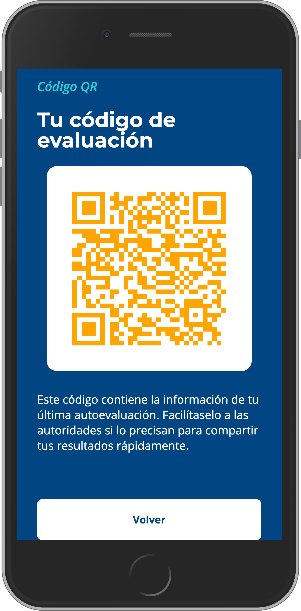 | | 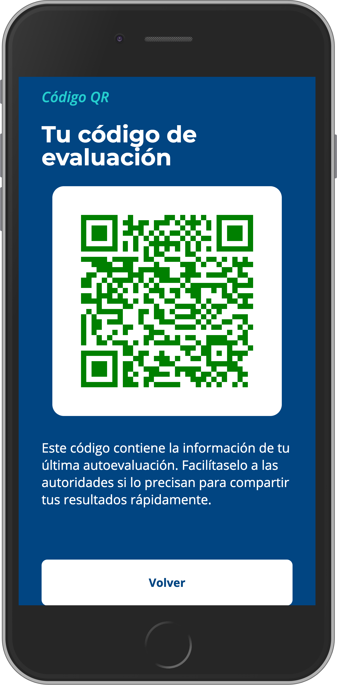

To determine if a user has had COVID-19 and has recovered, in the file `data/pages/syptom-checklist-page.json` a question must be registered with the property` isCured` set to `true`:

```json
{
  "id": "covid19_curado",
  "score": 0,
  "isCured": true,
  "title": {
    "es": "¿Has tenido coronavirus antes y has recibido el alta?"
  }
}
```

## COVID-19 recommendations.
Predetermined recommendations are the ones that have been established by the Comunidad de Madrid in Spain.

## Android / iOS distribution

On the links below you can find how to pack your application for Android and IOS platforms.The referenced projects can be found on the openpandemic-mobile folder.

* Android: Read [README](./openpandemic-mobile/android/README.md)
* iOS: Read [README](./openpandemic-mobile/ios/README.md)

## Firebase Functions
The three functions developed are located in `openpandemic-functions` folder:
* `positive_contacts`: it is a function triggered on a test result insertion. If the result of the test is positive a random identifier for the user is included in a separated collection. This way we get an anonymous tracking of the devices and ids cannot be related with each others.
* `qrcode-get`: this is a code generation sample to draw a QR. Authorities who are going to implement this app shall rewrite this generation according to the QR readers in their apps.

## Best practices to usable for everyone during COVID-19

The best practices of this project follow [this page](https://web.dev/covid19/) comes from a cross-functional collection of teams within Google that are shifting their short-term focus to support websites that are helping people stay safe during the COVID-19 situation.

Some of the recommendations we have followed are:

* Identity, security, and privacy.
* Focusing on accessibility.
* Caching strategies to reduce demands on your servers with minimal code change.
* Use principles of good mobile design

## ¿How to Contribute?
If you want to contribute to the project please read first [CONTRIBUTING.md](./CONTRIBUTING.md)

¡Pull Request wellcome! 💪🏻

## Supported Browsers
<table>
  <tr>
    <td align="center"><br><b>Edge</b></td>
    <td align="center"><br><b>Firefox</b></td>
    <td align="center"><br><b>Chrome</b></td>
    <td align="center"><br><b>Safari</b></td>
    <td align="center"><br><b>Mobile Safari</b></td>
  </tr>
  <tr>
    <td align="center">Last 2 versions</td>
    <td align="center">Last 2 versions</td>
    <td align="center">Last 2 versions</td>
    <td align="center">Last 2 versions</td>
    <td align="center">Last 2 versions</td>
  </tr>
</table>

