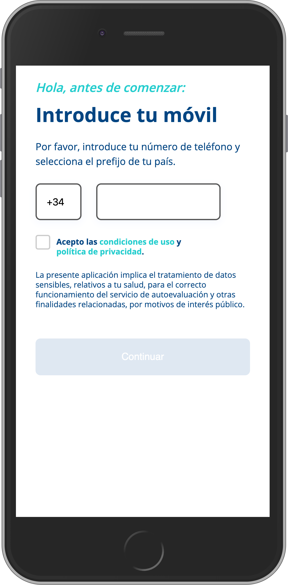
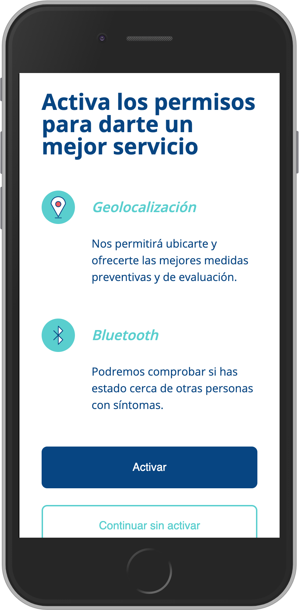
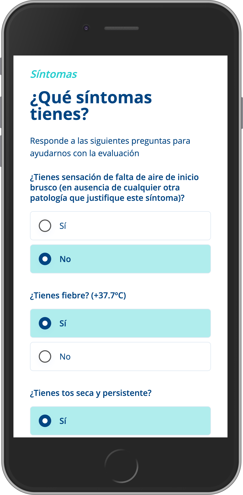
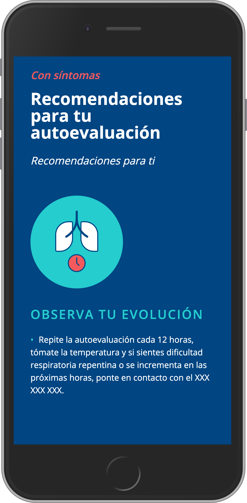
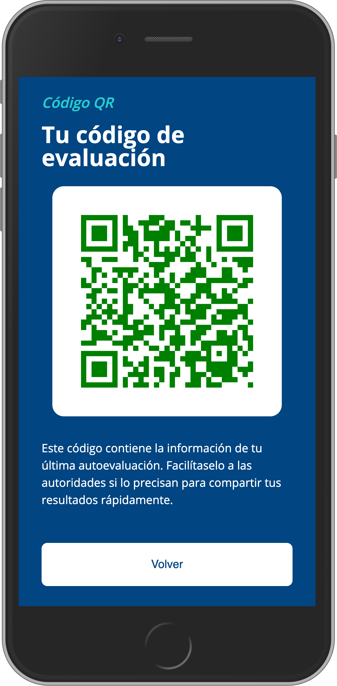
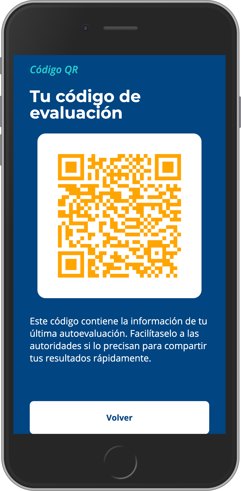
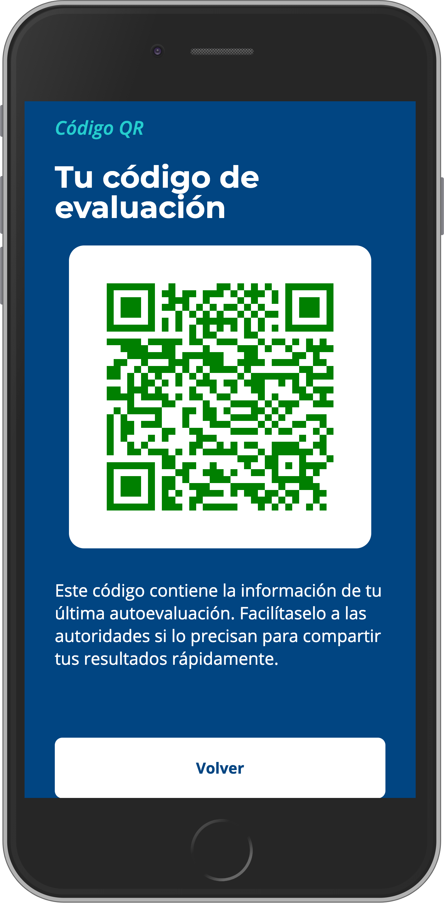

<p align="left">
  <!--img width="120" alt="router hero banner" src="logo.png"-->
  <h2 align="left">Open Pandemic App</h2>
</p>

[](https://github.com/open-wc)

Esta aplicación está basada en la idea [Corona Madrid](https://coronamadrid.comunidad.madrid/)

Open Pandemic App es una aplicación (Progressive Web App) que ayuda a realizar un seguimiento de los ciudadanos en cuarentena a causa del coronavirus.

Las principales características que ofrece la aplicación son:

* 📝 Evaluar la situación de salud de una persona en función de sus sintomas
* ⏰ Evaluar a las personas cada cierto tiempo y mantener actualizado su estado de salud
* 📲 Recibir a través de la aplicación instrucciones y recomendaciones en función de tu estado de salud
* 🏥 Ayudar a todos los profesionales de la salud que trabajan por la seguridad y bienestar de las personas
* ❤️ Código QR de salud personal basado en los síntomas, localización y personas infectadas en su proximidad (Contact tracing).

## Screenshots de la aplicación

| | | |
|:--:|:--:| :--:|
|  | | 
|  | | 
|  | | 

## Stack Tecnológico

Para el desarrollo de esta App se han usado las siguientes librerías:

* [open-wc](https://open-wc.org/). Se trata de un proyecto Open Source con recomendaciones y buenas prácticas en proyectos basados en Web Components.
* [LitElement](https://lit-element.polymer-project.org/). Toda la App ha sido construida con los estándares de Web Components, utilizando LitElement como librería base.
* [Vaadin Router](https://vaadin.com/router). Es una pequeña biblioteca JS (<7kb) para gestionar las rutas de la aplicación en el lado del cliente.
* [Firebase](https://firebase.google.com/). Usamos el sdk web de firebase para la conexión al servicio cloud de Firebase para autenticación y para almacenar datos.
* [Google Recaptcha](https://www.google.com/recaptcha/intro/v3.html). Es un servicio gratuito de Google que protege tu sitio web contra spam y abuso.
* [Web Component Qr code](https://github.com/educastellano/qr-code). Web Component para generar códigos QR


## Estructura del proyecto

```
openpandemic-app
│
├── openpandemic-web
├── openpandemic-mobile
│   ├── android
│   └── ios
└── openpandemic-functions    
```

El proyecto queda estructurado de la siguiente manera:
* `openpandemic-web`: contiene el código fuente del proyecto web. Es la propia Progressive Web App. Esta app puede usarse con independencia de la parte mobile si no se desea realizar contact tracing.
* `openpandemic-mobile`: contiene el código fuente del proyecto mobile para empaquetar el proyecto web en Android e iOS.
* `openpandemic-functions`: contiene el código con las funciones usadas en Firebase Functions.


## Scripts

Este proyecto requiere Node 10 y npm 6 o superior.

La mayor parte de utilidades para probar, construir y servir la aplicación se encuentra en el fichero 'package.json' para reducir la cantidad de ficheros del proyecto. Si aplica mucha personalización a la configuración, puede moverlas a ficheros individuales.

Puede ejecutar los scripts con npm desde la raíz del proyecto:

```bash
# lanza la aplicación para desarrollo, recargándose cuando un fichero cambia
npm run start

# lanza la aplicación después de haber sido construida con el comando build
npm run start:build

# construye la aplicación y la deja en el directorio `dist`
npm run build

# lanza los tests con Karma
npm run test

# lanza el linter del proyecto
npm run lint

```

## Autenticación de Usuarios

Open Pandemic App hace uso de Firebase phone-auth (https://firebase.google.com/docs/auth)

Para configurar la App para que haga uso de tu instancia de firebase tan sólo tienes que crear el fichero `/data/firebase-config.json` y guardar en él [el objeto de configuración firebase](https://firebase.google.com/docs/web/setup?hl=es-419#config-object).
```json
{
  "apiKey": "api-key",
  "authDomain": "project-id.firebaseapp.com",
  "databaseURL": "https://project-id.firebaseio.com",
  "projectId": "project-id",
  "storageBucket": "project-id.appspot.com",
  "messagingSenderId": "sender-id",
  "appID": "app-id",
}
```

## Consideraciones legales

El software y la aplicación resultante del mismo, permiten la recogida y tratamiento de datos de carácter personal. Es responsabilidad de la persona física o jurídica que utiliza el software y publica una aplicación basada en el mismo el cumplimiento con la normativa de protección de datos de la jurisdicción donde se publique la aplicación. Especialmente si es de aplicación el Reglamento (UE) 2016/679 de protección de datos de carácter personal (GDPR) será su responsabilidad el cumplimiento de deber de información contenido en el artículo 13 del GDPR


## Datos personales

La App por defecto sube 4 tipos de datos a firebase para que el gestor de la APP pueda hacer un seguimiento de los usuarios:
* Datos personales sensibles (Nombre, DNI, Direccion)
* Datos clinicos (Sexo y Edad)
* Localizacion
* Resultados del test

Si se activa el flag *enablePersonalData* no se pedirán ni subirán datos personales sensibles. Igualmente no se subira la localización exacta, solo una localizacion aproximada (Nivel código postal) si así lo indicas con el flag *locationHighAccuracy*. Puedes encontrar ambos en el fichero `/data/app-config.json`

## Traceo de contactos

El fichero de configuración `/data/app-config.json` permite activar el flag *enableContactTracking*. Si se activa este flag, se monitoriza la presencia cercana de dispositivos móviles de personas que hayan reportado ser portadoras del virus. Esta presencia es usada en el algoritmo de asignación de recomendaciones.

Para realizar esta monitorizacíon es imprescindible el uso de las apps nativas liberadas también en este repositorio.

Este traceo se hace de una forma completamente anónima, pero para mejorar el anonimato y explicitar el consentimiento queremos seguir las recomendaciones del siguiente paper publicado el 2 de abril con amplio respaldo de la comunidad académica: https://github.com/DP-3T/documents

La implementación realizada es una simplificación de ese modelo. Lo que se hace actualmente es lo siguiente:
* Generar un identificador aleatorio y emitirlo a los dispositivos cercanos
* Tracear los identificadores aleatorios de otros usuarios y almacenarlos en el dispositivo (No hay manera de asociar estos identificadores con otros usuarios)
* En caso de tener sintomas, informamos al servidor de nuestro identificador para que nos almacene como identificador sospechoso.
* El servidor nos devuelve la lista de todos los identificadores sospechosos
* En local, en el dispositivo, comprobamos la lista descargada identificadores sospechosos con toda la lista que hemos generado localmente.

La App nunca informa al servidor de los ids que han sido traceados.

## Cambiar preguntas y respuestas del test

Las preguntas, recomendaciones y el algoritmo que se sigue para determinar las recomendaciones son muy fácilmente personalizables:
* Para cambiar las preguntas, hay que modificar el fichero `data/pages/symptom-checklist-page.json` con las preguntas que se quieren realizar a los usuarios. Cada pregunta tiene un *score* que se utiliza en el algorimo de asignacion de recomendaciones
* En `src/pages/symptom-checklist-page.js` se determina qué resultado dar al usuario, para ello se suman los scores de todas las respuestas afirmativas y si supera el *treshold* (por defecto 30) se le manda a la recomendación de "symptoms" y si no lo supera al de "no-symptoms"
* Para cambiar las recomendaciones de **symptoms** hay que modificar el fichero `data/pages/recommendation-symptoms.json` y para cambiar las de **no-symptons** hay que cambiar el fichero `data/pages/recommendation-no-symptoms-page.json`
```json
{
  "threshold": 30,
  "questions": [
    {
      "id": "falta_aire",
      "score": 60,
      "title": {
        "es": "¿Tienes sensación de falta de aire de inicio brusco (en ausencia de cualquier otra patología que justifique este síntoma)?"
      }
    },
    {
      "id": "fiebre",
      "score": 15,
      "title": {
        "es": "¿Tienes fiebre? (+37.7ºC)"
      }
    },
    ...
    ...
  ]
}
```
## Tiempo de espera entre autoevaluaciones
El usuario debe esperar un tiempo recomendado de 12hs para repetir la autoevaluación.
Este tiempo puede establecerse en el fichero de configuarción de la aplicación:
`/data/app-config.json` en la propiedad `waitTimeForNextAutoevaluation`. *Este tiempo debe estar expresado en minutos*

## QR Código de evaluación

Los usuarios en sus teléfonos móviles pueden hacer uso de la funcionalidad "Código de evaluación" dónde se presenta un código QR que resume los resultados de la evaluación realizada teniendo en cuenta los siguientes parámetros:

- Sintomalogía según autoevaluación
- Contacto cercano con personas con sintomatología COVID-19
- Recuperación tras alta después de haber tenido COVID-19

El código QR se presenta siguiendo una escala de colores para identificar visualmente el estado de la evaluación actual de la persona:
- `Naranja`: usuario sin síntomas no inmunizado.
- `Rojo`: usuario no inmunizado que ha reportado síntomas COVID-19 a través de la autoevaluación o ha estado próximo a personas con síntomas COVID-19.
- `Verde`: usuario inmunizado que ha indicado en una evaluación pasada que ha tenido COVID-19 pero actualmente se encuentra sin sintomas.

| | | |
|:--:|:--:| :--:|
|  | | 

Para determinar si un usuario ha tenido COVID-19 y se ha recuperado, en el fichero `data/pages/syptom-checklist-page.json` se debe dar de alta una pregunta con la propiedad `isCured` seteada en `true`:

```json
{
  "id": "covid19_curado",
  "score": 0,
  "isCured": true,
  "title": {
    "es": "¿Has tenido coronavirus antes y has recibido el alta?"
  }
}
```

## Recomendaciones ante el COVID-19
Las recomendaciones que vienen preconfiguras son las que ha establecido la Comunidad de Madrid.

## Distribución de la App como una aplicación Android / iOS

A continuación encontrarás cómo puedes empaquetar la aplicación web dentro de una aplicación nativa Android (apk) o iOS (ipa). Para ello puedes encontrar los proyectos que construyen y empaquetan la aplicación de ambas plataformas bajo el directorio openpandemic-mobile.

* Android: Leer [README](./openpandemic-mobile/android/README.md)
* iOS: Leer [README](./openpandemic-mobile/ios/README.md)

## Firebase Functions
Se han desarrollado tres funciones que se pueden encontrar en la carpeta `openpandemic-functions`:
* `positive_contacts`: es una función disparada cada vez que se incluye el resultado de un test en su subcolección. Si el resultado del test es positivo se incluye el identificador random de traceo de dicho usuario en una colección separada. Esto se hace para que el traceo sea anónimo y no se puedan cruzar identificadores.
* `qrcode-get`: es un ejemplo de generación de un código para dibujar un QR. Las autoridades que implementen esta app deberán reescribir la generación de dicho código para coordinarlo con las aplicaciones de lectura del QR.

## Buenas prácticas seguidas adaptadas al periodo de COVID-19 para mejorar el uso de la aplicación

Este desarrollo ha tratado de seguir en gran medida las siguientes [recomendaciones técnicas de diferentes equipos de Google](https://web.dev/covid19/) para apoyar a corto plazo que los desarrollos web sean accesibles, rápidos y seguros durante el periodo de COVID-19

Algunas de las recomendaciones que hemos seguido son:

* Seguridad y privacidad de los datos.
* Accesibilidad.
* Técnicas de cacheo para reducir la demanda de recursos al servidor.
* Principios de diseño y buenas prácticas mobile.

## ¿Cómo puedo contribuir con el proyecto?
Si deseas contribuir en el proyecto puedes leer el fichero [CONTRIBUTING.md](./CONTRIBUTING.md)

¡Pull Request son bienvenidas! 💪🏻

## Navegadores soportados
<table>
  <tr>
    <td align="center"><br><b>Edge</b></td>
    <td align="center"><br><b>Firefox</b></td>
    <td align="center"><br><b>Chrome</b></td>
    <td align="center"><br><b>Safari</b></td>
    <td align="center"><br><b>Mobile Safari</b></td>
  </tr>
  <tr>
    <td align="center">Last 2 versions</td>
    <td align="center">Last 2 versions</td>
    <td align="center">Last 2 versions</td>
    <td align="center">Last 2 versions</td>
    <td align="center">Last 2 versions</td>
  </tr>
</table>

