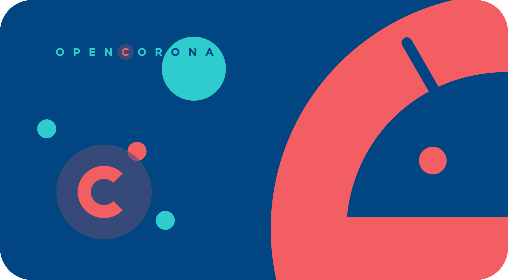
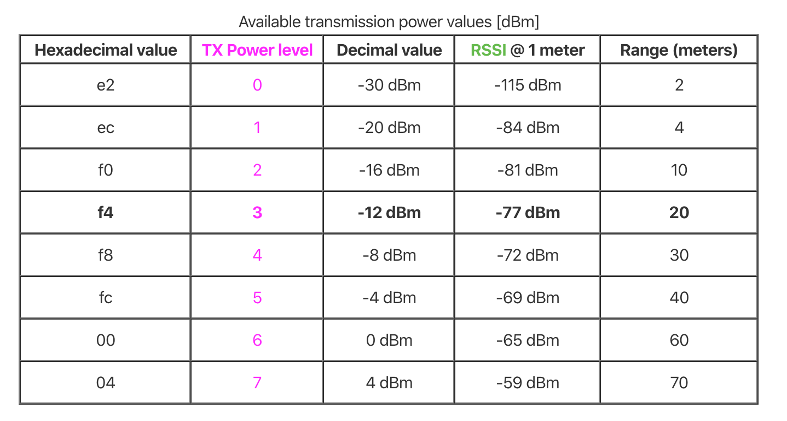

<p align="left">
  <br><br>
  <h2 align="left">Open Corona App Android</h2>
</p>

Open Corona App Android, is an application meant to embed a web application so it may be installed the same way a native Android application does. It will also provide help with corona virus quarantined citizens tracing, using devices capabilities such as Bluetooth LE in order to relate corona virus positive cases.

This application may be executed in both devices or emulators, using Android Studio 3.6 and upper versions.

## Installation

1. Deploy web application to a CDN.

2. Mind configuring URL, and other parameters inside Configuration file (utils/Configuration.kt) in the application.

3. Once the URL is set, connect an emulator or device, and execute following commands in a terminal:

```
# Build and install the application
./gradlew installDebug
```

You may also open this project using Android Studio 3.6 or upper versions and run the project directly using the IDE.

## Scripts

This project requires Kotlin 1.3.61 and gradle 3.5.3 or upper versions.

You may run gradle tasks, using gradlew from the root project:

```
# Build application
./gradlew build

# Package application
./gradlew assemble

# Build and install application
./gradlew installDebug

# Run linter
./gradlew lint
```

## Contact Scanning

Open corona application scans the environment thanks to Bluetooth LE technology, this process aims to relate users that could be near corona virus positive citizens.

Periodically (time set in TIME_INTERVAL) environment will be explored to find contacts (transmission strength power is set using ADVERTISE_TX_POWER) and data gathered will be analyzed.

During this time interval, users will be filtered by DISTANCE_THRESHOLD, in order to get contacts close enough to consider danger of contagion. This distance will be measured through scan results RSSI parameter explained in the table below.

<p align="left">
  <br><br>
</p>

Last, but not least, a minimum reception number (ENCOUNTERS) filter will be applied in order to discard those contacts that didn't take enough time close to them to consider a possible danger of contagion.

**Note:** Android devices are recognized using an UUID generated for each device. This UUID will be embedded inside advertising service attending to its restrictions, and will be decoded in reception in order to identify Android emitters.
In order to identify iOS devices, a connection to them will be established through a [GATT server](https://developer.android.com/reference/android/bluetooth/BluetoothGattServer) using a specific characteristic ID. This way, iOS devices may be uniquely identified.

## Application configuration

Inside application's Configuration file (utils/Configuration.kt) you may find the following parameters:

- **openpandemic_URL** - CDN web URL.

- **ADVERTISE_MODE** - Advertising emit mode. (*LOW_POWER, MODE_BALANCED, MODE_LOW_LATENCY*).

- **ADVERTISE_TX_POWER** - Advertising signal strength power (*ULTRA_LOW, LOW, MEDIUM, MEDIUM*).

- **TIME_INTERVAL** - Period of time sampling close devices.

- **ENCOUNTERS** - Encounter accounts inside a period of time, necessary to determine dangerous contact.

- **DISTANCE_THRESHOLD** - Distance considered dangerous for a contact. (2 meters by default)

## Technological Stack

+ [Kotlin](https://kotlinlang.org/) -  All application is written in Kotlin.
+ [Android X](https://developer.android.com/jetpack/androidx) - Android X application full support.
+ [GSON Library](https://github.com/google/gson) - Application data modeling.
+ [RxJava](https://github.com/ReactiveX/RxJava) - Application reactive programming.