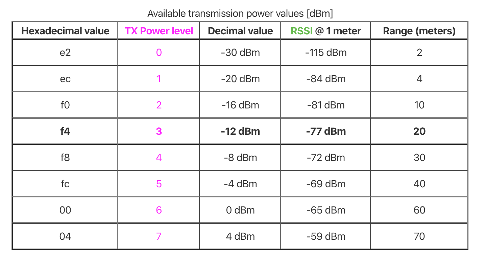

<p align="left">
  <br><br>
  <h2 align="left">Open Corona App Android</h2>
</p>

Open Corona App Android es una aplicación Android para encapsular la aplicación web e instalarla como una aplicación nativa que ayudará a realizar un seguimiento de los ciudadanos en cuarentena a causa del coronavirus y utilizar las capacidades nativas del teléfono (Bluetooth LE) para poner en contacto a ciudadanos que han dado positivo.

La aplicación puede ser ejecutada en un dispositivo o emulador usando Android Studio 3.6 o superior.

## Instalación

1. Despliega la aplicación web en una CDN.

2. Configura la URL (y el resto de parámetros del fichero) en el fichero de configuración (utils/Configuration.kt) de la aplicación.

3. Una vez establecida la URL. Conecta un emulador o dispositivo y ejecuta en el terminal:

```
# Construye e instala la aplicación
./gradlew installDebug
```

O abre el proyecto con Android Studio 3.6 o superior y corre el proyecto desde el IDE.

## Scripts

Este proyecto requiere Kotlin 1.3.61 y gradle 3.5.3 o superior.

Puedes ejecutar las tareas de gradle con gradlew desde la raíz del proyecto:

```
# Construye la aplicación
./gradlew build

# Empaqueta la aplicación
./gradlew assemble

# Construye e instala la aplicación
./gradlew installDebug

# Lanza el linter del proyecto
./gradlew lint
```

## Exploración de contactos

La aplicación de openpandemic explora el entorno a través de la tecnología Bluetooth LE para intentar poner en contacto a usuarios que han podido estar con ciudadanos positivos.

Cada cierto tiempo (establecido por TIME_INTERVAL) se explora el entorno en busca de contactos (la potencia de transmisión y recepción esta establecido por ADVERTISE_TX_POWER) y se analizan los datos obtenidos.

Durante ese intervalo se filtra por (DISTANCE_THRESHOLD) para obtener los contactos que han estado a una distancia considerada de peligro para un contagio. Esta distancia se calcula a partir del parámetro RSSI recibido de la comunicación con respecto a esta tabla.

<p align="left">
  <br><br>
</p>

Por último, se establece un número mínimo de recepciones (ENCOUNTERS) para descartar aquellos contactos que no han estado el tiempo suficiente como para considerarlo un riesgo de contagio.

**Nota:** Los dispositivos Android, se reconocen mediante el uso de un UUID generado para el dispositivo. Este UUID formará parte de los datos del servicio de emisión atendiendo a sus restricciones y será decodificado en la recepción para poder identificar al dispositivo Android emisor.
Por otra parte, para la detección dispositivos de la plataforma iOS, se establece una conexión con los mismos a través de un [servidor GATT](https://developer.android.com/reference/android/bluetooth/BluetoothGattServer) atendiendo a un ID de característica específico, de esta manera se puede determinar el identificador del dispositivo encontrado de forma única.

## Configuración de la aplicación

En el fichero de configuración (utils/Configuration.kt) de la aplicación se pueden configurar los parámetros:

- **openpandemic_URL** - URL de la CDN de la web.

- **ADVERTISE_MODE** - Modo de emisión del advertising. (*LOW_POWER, MODE_BALANCED, MODE_LOW_LATENCY*).

- **ADVERTISE_TX_POWER** - Potencia que se establecerá al advertising (*ULTRA_LOW, LOW, MEDIUM, MEDIUM*).

- **TIME_INTERVAL** - Tiempo de intervalo de muestreo de dispositivos cercano.

- **ENCOUNTERS** - Número de encuentros que tienen que producirse en el intervalo definido para considerarlo contacto.

- **DISTANCE_THRESHOLD** - Distancia que se considera de peligro para detectarlo como un contagio positivo. (Por defecto 2 metros)

## Stack Tecnológico

+ [Kotlin](https://kotlinlang.org/) -  Toda la aplicación esta escrita en Kotlin.
+ [Android X](https://developer.android.com/jetpack/androidx) - Soporte de toda la aplicación a Android X.
+ [GSON Library](https://github.com/google/gson) - Modelado de datos de la aplicación.
+ [RxJava](https://github.com/ReactiveX/RxJava) - Programación reactiva en la aplicación.