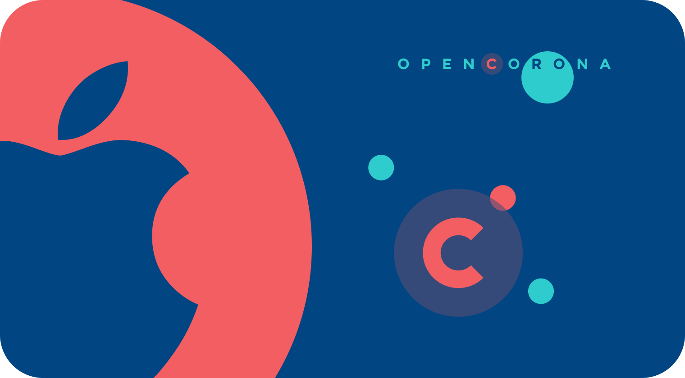
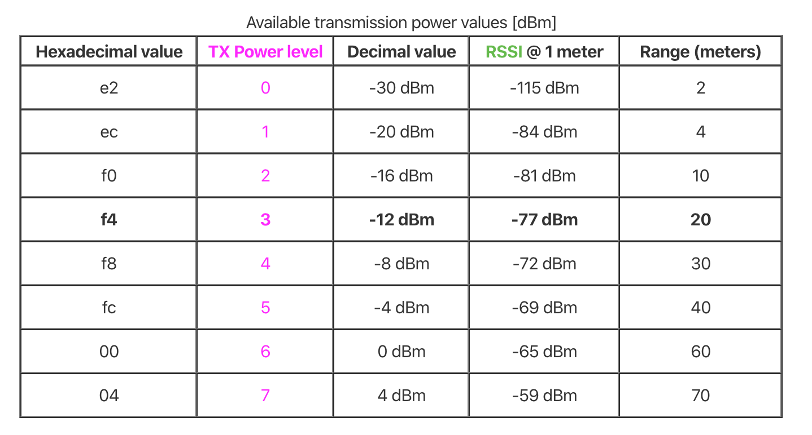

<p align="left">
  <br><br>
  <h2 align="left">Open Corona App iOS</h2>
</p>

Open Corona App iOS is an iOS application which embed the web app and gives the possibility of install it as a native application. It will also provide help with corona virus quarantined citizens tracing, using devices capabilities such as Bluetooth LE in order to relate corona virus positive cases.

This application can be run on a device using Xcode 11 or higher.

## Intalation

1. Deploy the web application into a CDN.

2. Configure this URL (and the rest of parameters constants) in the configuration file ```Config.swift``` inside the Utils folder.

3. Connect your device and run the app in Xcode.

## Scripts

This project needs Swift 5.0 and xcodebuild 11.3 or higher.

To get an .ipa from this proyect you could execute the xcodebuild instructions from the root folder of the project.

```
# 1.- Archive the app
xcodebuild archive -project openpandemic.xcodeproj -scheme openpandemic -archivePath openpandemic.xcarchive -configuration Release DEVELOPMENT_TEAM=<Your_Team_id> -quiet

# 2.- Export the app
xcodebuild -archivePath openpandemic.xcarchive -exportPath ./signed -exportArchive -exportOptionsPlist /path/to/your/exportOption.plist -quiet -allowProvisioningUpdates

```
For more information about how to fill the exportOption.plist file [see here](https://developer.apple.com/library/archive/technotes/tn2339/_index.html#//apple_ref/doc/uid/DTS40014588-CH1-WHAT_KEYS_CAN_I_PASS_TO_THE_EXPORTOPTIONSPLIST_FLAG_).

## Contacts Scanning

Open corona application scans the enviroment thanks to Bluetooth LE technology, this process aims to relate users that could be near corona virus positive citizens.

Periodically (time set in ```timeInterval```) data garthered from the environment will be analyze in order to look for new contacts.

During this time interval, users will be filtered by distance (```distanceThreshold```), in order to get contacts close enough to consider danger of contagion. This distance will be measured through scan results RSSI parameter explained in the table below.

<p align="left">
  <br><br>
</p>

Last, but not least, a minimum reception number (```encounters```) filter will be applied in order to discard those contacts that didn't take enough time close to them to consider a possible danger of contagion.

**Nota:** To recognize iOS devices, a conexion through Bluetooth LE is established to the peripheral and the peripheral device UUID is requested (```UIDevice.current.identifierForVendor```). When the peripheral responds whit its identifier, then central device stores it, taking into account the previous filter. 
On the other hand, for the recognition of Android devices, the information is obtained from the AdvertisementData, where the device UUID is located.

## App Configuration

In the app configuration file it's possible to configure these parameters:

- **openpandemicURL** - CDN web URL.
- **timeInterval** - Period of time sampling close devices.
- **encounters** - Encounter accounts inside a period of time, necessary to determine dangerous contact.
- **distanceThreshold** -  Distance considered dangerous for a contact. (2 meters by default)

## Stack Tecnológico

* [Swift](https://swift.org/). All application was written in Swift.
